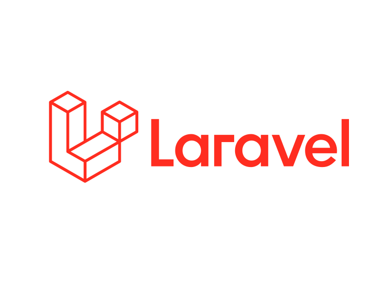
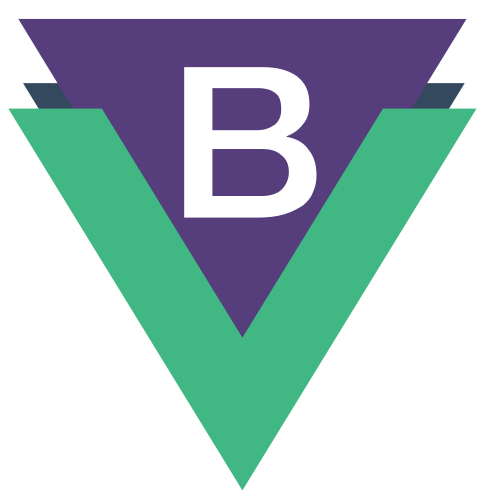

<h1>Desenvolvedor Fullstack</h1>

👋 Olá! Meu nome é Lucas Rodrigues e sou Desenvolvedor Fullstack, com experiência em diversas tecnologias.

<h6 id="#lucas-rodrigues-programador">Estou sempre aberto a novas oportunidades e para falar comigo é só clicar no link: 👉 https://linkme.bio/lucasrodriguesprogramador 👈</h6>

> Desde 2017, trabalho com desenvolvimento e já participei de vários projetos de sucesso.
>   Desenvolvi sistemas de imobiliárias, sales force, sistema de booking, entre outros.
>   Tenho experiência em construir RESTful APIs e microserviços, além de otimizar o desempenho de aplicativos web e lidar com grandes volumes de dados.

**Estou sempre em busca de aprimorar minhas habilidades 🧠 e aprender novas tecnologias. 💻 🚀**

> Atualmente, estou disponível para novos projetos, mentorias e prefiro trabalhar remoto.

#### 🔭 Atualmente estou trabalhando em:
> 👉 Pacote javascript/typescript para injeção e inversão de dependências, DI e IOC (Inversion of Control) que logo estará disponível para download no NPM.

> 👉 Também dou suporte ao meu pacote PHP que é utilizado em mais de 200 mil projetos! O 👉 [urameshibr/lumen-form-request](https://github.com/urameshibr/lumen-form-request) 👈

#### 🌱 Atualmente estou aprendendo:
> 👉 Typescript

#### 👯 Estou procurando colaborar em projetos de:
> 👉 Aplicações web, de preferência com Laravel e Vue.JS (mas sei me virar muito bem em outras stacks).

#### 🙋 Estou disponível para novos projetos fixos, remoto ou freelancers.

### 🤓 Um pouco sobre mim:

> Gosto de gatos, eu tenho um chamado Mew (me inspirei no Pokémon!).
>   Gosto de ajudar as pessoas, pra mim nunca tem tempo ruim e gosto de desenvolver soluções, sempre pensando na melhor entrega para o usuário.
>   Meu hobby, além de estudar e programar, é caminhar, comer uma pizza com os amigos e jogar Dota 2.

### 📫 Como entrar em contato comigo:

https://linkme.bio/lucasrodriguesprogramador

> Ah! E também escrevo alguns artigos que você pode ver aqui no meu blog:
>   👉 https://lucasrodriguesprogramador.com.br/blog 👈
>   Lá você vai encontrar ótimos artigos sobre desenvolvimento web com PHP e Javascript!

### Algumas das minhas competências técnicas:

<table>
  <colgroup>
    <tr>
      <td colspan="10"><b>Tecnologias Backend</b></td>
    </tr>
    <tr>
    <td align="center" width="96">
      
       PHP 7+
    </td>
    <td align="center" width="96">
      
       Laravel
    </td>
    <td align="center" width="96">
      
       Node.js
    </td>
    <td align="center" width="96">
      
       Adonis.js
    </td>
    <td align="center"  width="96">
      
       Nuxt.js
    </td>
  </tr>
  <tr>
    <td align="center"  width="96">
      
       PHP Unit
    </td>
    <td align="center"  width="96">
      
       Design Patterns
    </td>
    <td align="center" width="96">
      
       TypeScript
    </td>
    <td align="center" width="96" style="position: relative">
      
       
       Clean Architeture
    </td>
    <td align="center" width="96">
      
       S.O.L.I.D.
    </td>
  </tr>
  </colgroup>
  <colgroup>
    <tr>
      <td colspan="10"><b>Tecnologias Frontend</b></td>
    </tr>
    <tr>
      <td align="center" width="96">
        
         Vue.js
      </td>
      <td align="center" width="96">
        
         Vuetfy.js
      </td>
      <td align="center" width="96">
        
         BootstrapVue
      </td>
      <td align="center" width="96">
        
         Quasar.js
      </td>
      <td align="center" width="96">
        
         Buefy.js
      </td>
    </tr>
    <tr>
      <td align="center" width="96">
        
         JQuery.js
      </td>
      <td align="center" width="96">
        
         Bootstrap
      </td>
      <td align="center" width="96">
        
         Sass
      </td>
      <td align="center" width="96">
        
         CSS 3
      </td>
      <td align="center" width="96">
        
         HTML 5
      </td>
    </tr>
  </colgroup>
  <colgroup>
    <tr>
      <td colspan="10"><b>Tecnologias Fullstack</b></td>
    </tr>
    <tr>
      <td align="center" width="96"> 
        
         Docker
      </td>
      <td align="center" width="96">
        
         MySQL
      </td>
      <td align="center"  width="96">
        
         PostgreSQL
      </td>
      <td align="center"  width="96">
        
         Debian
      </td>
      <td align="center"  width="96">
        
         Apache
      </td>
    </tr>
    <tr>
      <td align="center"  width="96">
        
         Ansible
      </td>
      <td align="center"  width="96">
        
         Deploy
      </td>
      <td align="center"  width="96">
        
         Git
      </td>
      <td align="center"  width="96">
        
         oAuth
      </td>
      <td align="center"  width="96">
        
         OpenCart
      </td>
    </tr>
  </colgroup>
</table>

